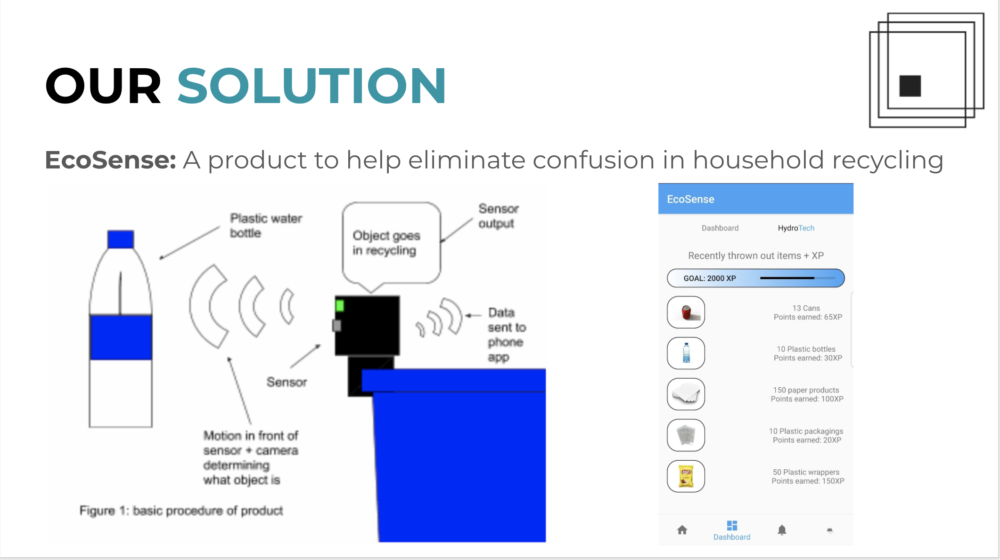
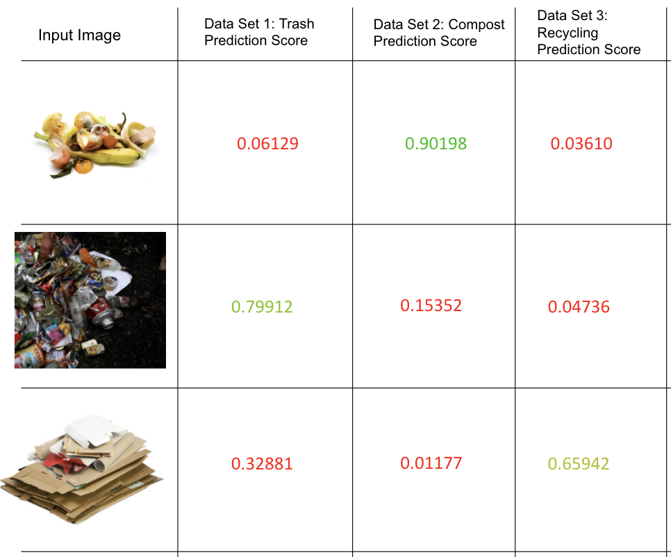

# Motivation
Every single year, billions of pounds worth of trash is dumped without any possible way to recycle.
Out of these billions, in Canada up to 25% of all recyclables are contaminated, hence turn to trash. (CBC, 2019)
Some quick math tells us that this equates to millions of pounds worth of trash being contaminated in Canada.
A little bit of research shows us that the leading cause of contamination is because of municipal and household garbage cans.
What if we had a way to recognize contaminated garbage, and spark a movement of cleaner household and municipal waste removal?
Meet Trash-R. Pitched at SHAD 2019 it got lots of praise by McGill University Judges for its unique concept and approach.

## Tensorflow
This is a generic setup and can be used to classify almost any type of image. I created a small demo that classifies three image data sets: garbage, recycling, and compost.

We use the help of Gradient Boosting to identify potentially contaminated recycling vs. just the regular approach. I found its better at identifying common contaminants such as oil & liquid stains.

The dataset used to train the model consists of 2,567 images from the Google Images database, a long with certain datasets from the McGill Environmental department.

## SHAD 2019 Pitch Competition
Here were some early prototype examples of what we envisioned Trash-R to be

## Results:

